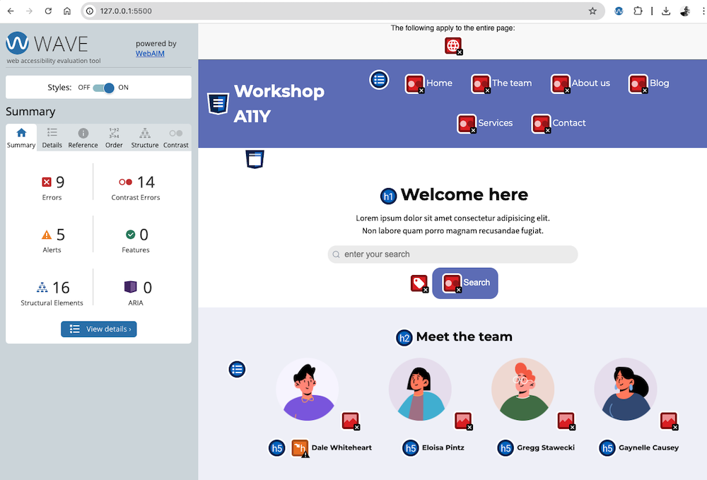
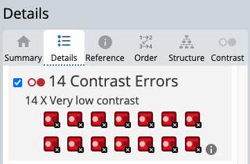
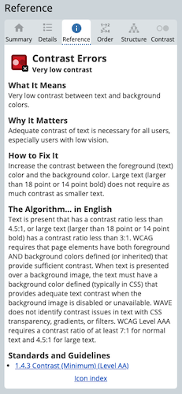
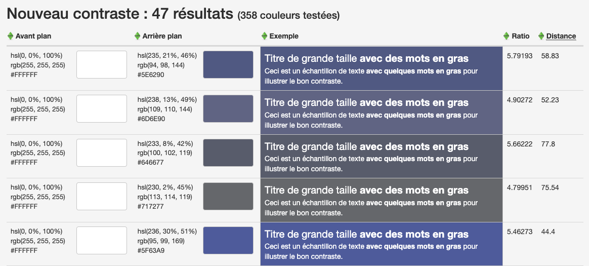
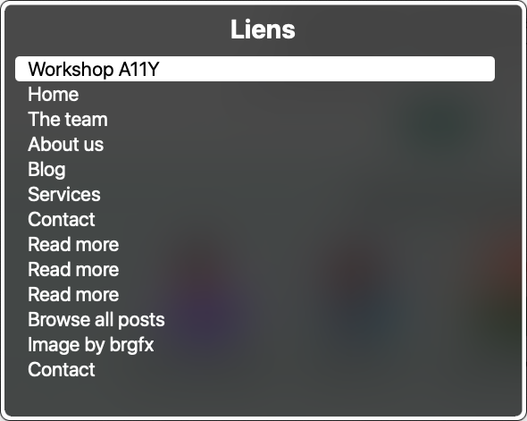
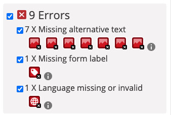

# Atelier A11Y

Nous avons vu lors des précédents ateliers « **intégration HTML/CSS** » comment utiliser de manière appropriée le HTML sémantique, exploiter sa richesse pour définir du CSS optimisé et rendre une page web responsive.

Ce troisième volet « **accessibilité** » sera lui aussi entièrement consacré au HTML et CSS. 

## Objectifs

Pour nous aider à concevoir des interfaces web accessibles, nous pouvons nous appuyer sur [le référentiel Web Content Accessibility Guidelines (WCAG)](https://www.w3.org/WAI/standards-guidelines/wcag/fr) (se prononce WOU-CAG) mis en place par le consortium **W3C**.  Ce guide est largement pris en référence dans les réglementations de nombreux pays, dont la France sous le référentiel [RGAA (**R**éférentiel **g**énéral d'**a**mélioration de l'**a**ccessibilité)](https://accessibilite.numerique.gouv.fr/). Le principe est de définir les règles permettant aux personnes en situation de handicap d'avoir accès aux fonctionnalités d'une interface web à égalité avec tous les utilisateurs, que ce soit dans le cas de troubles visuels, moteurs, cognitifs, temporaires ou permanents.


**Les objectifs de cet atelier** :  
• Identifier des erreurs de conception et d'intégration concernant les régles d'accessibilité sur une page web    
• Découvrir les préconisations du WCAG  
• Corriger les erreurs en choisissant une méthode appropriée
{: .alert-info :}

## Démarrage

Commence par cloner ce dépôt grâce au lien ci-dessus ⬆ <a href="#input-clone"><i class="bi bi-code-slash"></i>&nbsp;Code</a>. Tu peux aussi télécharger le dossier zippé en suivant le lien vers **GitHub** si tu n'utilises pas Git.  
Ouvre ensuite le dossier du projet avec ton **IDE** puis accède au fichier `index.html` avec ton navigateur.

Dans cet atelier, nous travaillerons uniquement sur cette page d'accueil composée d'une barre de navigation, d'un mini formulaire de recherche et de plusieurs sections présentant du faux contenu.  
Le design est certes très classique mais à première vue cette page semble tout à fait fonctionnelle.  

Regardons cela de plus près.

## 🔧 Un premier outil

De nombreux outils sont proposés par la communauté pour aider les développeurs à tester l'accessibilité de leurs interfaces. À ce jour, aucun ne peut remonter l'intégralité des erreurs de conception mais ils permettent tout de même d'identifier facilement et rapidement de nombreux problèmes liés aux contrastes des couleurs, à la cohérence de la structure HTML, à l'absence de certains attributs ou de contenus explicites.  

C'est le cas de l'extension **Wave** développée par [la société WebAIM](https://webaim.org/).  
Installe cette extension pour ton navigateur.
- [Wave pour Chrome](https://chromewebstore.google.com/detail/wave-evaluation-tool/jbbplnpkjmmeebjpijfedlgcdilocofh) (ou tout navigateur basé sur Chromium), 
- [Wave pour Firefox](https://addons.mozilla.org/fr/firefox/addon/wave-accessibility-tool/)

Il faudra ensuite que tu autorises l'accès aux URL de fichier dans les réglages de l'extension.
  

Lorsque tu actives l'extension sur la page `index.html`, tu dois voir quelque chose comme ceci :




« _…à première vue cette page semble tout à fait fonctionnelle._ » Pas si sûr 🙄.   
Corrigeons cela.


## 🚫 Contraste des couleurs

Commençons par les erreurs liées aux contrastes des couleurs. Il semble y en avoir beaucoup mais nous allons pouvoir les corriger toutes d'un seul coup.

L'onglet _Details_ de l'extension **Wave** liste l'ensemble des erreurs triées par catégories.

  
{: .text-center :}
Chaque carré rouge est cliquable et permet d'identifier quel élément est concerné par l'erreur.  
En cliquant sur la petite icône <i class="bi bi-info-circle-fill"></i>, l'onglet _Reference_ s'active et permet de comprendre la nature de l'erreur, à quel point du référentiel elle est associée et comment la résoudre.


{: .text-center :}

Ici, il s'agit du point [1.4.3 Contrast (Minimum) - Level AA](https://www.w3.org/WAI/WCAG22/quickref/?showtechniques=143#contrast-minimum) qui préconise de «&nbsp;*veiller à ce qu'un **rapport de contraste d'au moins 4,5:1** existe entre le texte (et les images du texte) et l'arrière-plan derrière le texte*.&nbsp;»  

Le but de cette règle est d'assurer une parfaite lisibilité des contenus pour les utilisateurs souffrant de troubles visuels. Un utilisateur en situation d'exposition à une forte intensité lumineuse pourrait également être concerné par cette règle (par&nbsp;exemple&nbsp;:&nbsp;consulter un site sur smartphone en extérieur très ensoleillé).

Il se trouve en effet que l'intensité de la couleur principale, le bleu, ne soit pas assez prononcée pour atteindre cette valeur lors d'une superposition avec le blanc. Que ce soit dans un sens ou dans l'autre. Cela concerne la barre de navigation, le bouton de recherche mais également les liens des articles.  
Pour corriger cela, rends-toi sur cette application web <a href="https://app.contrast-finder.org/" target="_blank">https://app.contrast-finder.org/</a>. En indiquant le code du bleu `#8084C2` pour le fond et le code du blanc `#fff` pour le texte, tu constates en effet que le ratio est de **3,5:1**.

L'interface te propose de trouver une couleur proche et respectant ce ratio.  
Tu peux aussi effectuer une recherche sur une palette de couleurs plus large si tu le souhaites.


Une série de couleur t'est proposée en cliquant sur le bouton « *Trouver des couleurs valides* ». 




> **🎯 À toi de jouer**  
Récupère le code de la couleur de ton choix et modifie la valeur de la variable CSS `--main-color` du fichier `assets > syles > variables.css`.  
Lorsque tu recharges ton navigateur, les erreurs de contraste des couleurs doivent avoir disparues de l'extension **Wave**.  
> **À noter** : en projet web, les couleurs de la charte graphique sont généralement validées dès l'étape de maquette. Mais il arrive que certains contrastes et dégradés de couleurs n'aient pas été testés. C'est alors au moment de l'intégration que ces erreurs apparaissent.

## ⚠️ Structure HTML

Continuons avec les corrections liées aux alertes de structure (nous reviendrons sur les autres erreurs ensuite).  


En consultant l'onglet _Reference_ de l'extension, tu découvres cette fois qu'il s'agit d'une alerte mentionnée dans plusieurs points du référentiel **WCAG**.
- [1.3.1 Info and Relationships (Level A)](https://www.w3.org/TR/WCAG22/#info-and-relationships)
- [2.4.1 Bypass Blocks (Level A)](https://www.w3.org/TR/WCAG22/#bypass-blocks)
- [2.4.6 Headings and Labels (Level AA)](https://www.w3.org/TR/WCAG22/#headings-and-labels)  
  
N'hésite pas à suivre ces liens. On y apprend notamment que respecter la hiérarchie des intertitres (`<h1>` à `<h6>`) permet aux lecteurs d'écran de présenter correctement les contenus aux utilisateurs et leur offre la possibilité de naviguer au clavier de section en section au sein d'une même page grâce à des intertitres explicites.

> **🎯 À toi de jouer**  
>Modifie le fichier `index.html` de sorte à respecter l'ordre des intertitres `<h1>`, `<h2>`, `<h3>`, etc.
><details markdown="1">
><summary>Solution</summary>
>
>- La liste des membres de l'équipe (section _Meet the team_) contient des titres `h5` qui devraient être des `h3`.
>- De la même façon, les articles de la section _Featured posts_ contiennent des titres de niveau `4` au lieu de niveau `3`.
>
>**À noter** : Il s'agit là d'une erreur classique où la personne en charge de l'intégration (ou de la rédaction du contenu) se sert des balises HTML pour appliquer un rendu visuel (ici une taille de police très certainement).   
>Modifie le CSS si tu souhaites appliquer une taille de police plus petite sur les intertitres que tu viens de corriger.
></details>

## ⚠️ Compréhension des liens

Terminons l'onglet des alertes et regardons celles liées aux contextes des liens.


Ces alertes concernent les liens « *Read more* » des articles. L'extension nous alerte sur l'ambiguité des textes de ces liens qui pourrait générer de la confusion pour les utilisateurs se servant de lecteurs d'écran. En effet, que va t-il se passer lorsqu'un assistant d'écran lira un de ces liens ?  
« **Lire la suite** ». La suite de quoi ? 

Pour mieux comprendre, voici une capture écran de l'assistant **VoiceOver** de MacOS. Ce type d'outil permet de consulter la liste des liens pour naviguer sur la page plus rapidement. On y retrouve nos trois liens « *Read more* » perdus dans la liste.



Ce problème est identifié dans le référenctiel **WCAG** au point **2.4.4 Link Purpose (In Context)**.
>[2.4.4 Link Purpose (In Context) - Level A](https://www.w3.org/WAI/WCAG22/quickref/?showtechniques=244#link-purpose-in-context)  
>*L'objectif de chaque lien peut être déterminé à partir du texte du lien seul ou du texte du lien avec son contexte déterminé par programmation*.

Plusieurs solutions peuvent être envisagées.  
Dans le cas présent, tu ne souhaites pas modifier le texte du lien (*Read more*). Il est cependant possible de l'associer à un autre élément de la page, au titre du même article par exemple.  
C'est une des solutions qui est proposée en utilisant l'attribut `aria-labelledby` [https://www.w3.org/WAI/WCAG22/Techniques/aria/ARIA7.html](https://www.w3.org/WAI/WCAG22/Techniques/aria/ARIA7.html).  

🎯 **Voici comment procéder**.  
Ajoute un `id` à chaque lien et chaque titre d'article, puis associe-les grâce à l'attribut `aria-labelledby` en indiquant les deux valeurs séparées par un espace. Comme ceci par exemple :

```html
<article>
    <h3 id="article-1">Enjoy boats transports</h3>
    <p>
        Lorem ipsum…
    </p>
    <a href="#" id="link-1" aria-labelledby="link-1 article-1">Read more</a>
</article>
<article>
    <h3 id="article-2">A journey in the footsteps of history</h3>
    <p>
        Lorem ipsum…
    </p>
    <a href="#" id="link-2" aria-labelledby="link-2 article-2">Read more</a>
</article>
//...
```

La capture suivante nous montre à présent que l'assistant d'écran concatène à chaque fois les deux textes ciblés permettant ainsi aux utilisateurs de mieux comprendre l'objectif des liens.


L'autre intérêt de cette technique est son approche programmatique. Les textes des titres peuvent changer sans risque au gré des publications et sans devoir mettre à jour un attribut, dès lors qu'ils restent compréhensibles bien entendu.  

Si tu utilises un langage de programation pour composer ce type de section où des articles sont agrégés (à l'aide d'une boucle en **JavaScript** ou **PHP** par exemple), il est très facile de générer ces attributs `id` et `aria-labelledby` en utilisant un identifiant unique, un [slug](https://developer.mozilla.org/en-US/docs/MDN/Writing_guidelines/Writing_style_guide#slugs) ou toute autre technique de ton choix. 
{: .alert-info :}

Lorsque tu recharges ta page après ces dernières modifications, tu constates sans doute que l'extension **Wave** affiche toujours les alertes. Cela s'explique par le fait que l'extension ne peut décider si la liaison entre chaque élément suffit à donner du sens aux liens (les textes pouraient ne pas être explicites, il faut donc rester vigilant). En revanche, trois *Aria Label* sont désormais listés en bas de l'onglet *Details*.


## 🚫 Langue principale, textes alternatifs, et labels

Revenons à présent sur les autres erreurs indiquées par l'extension **Wave**.



> **🎯 À toi de jouer**  
>Essaie de procéder comme nous l'avons fait précédemment en consultant les ressources vers le référentiel **WCAG** et de trouver les solutions appropriées pour corriger ces erreurs.
>
><details markdown="1">
><summary>Solutions</summary>
>- L'erreur *Missing alternative text* concerne sept images.  
>Encore une fois, il y a ici  plusieurs façons de traiter cette erreur.
>   - Pour les avatars des membres de l'équipe, tu peux utiliser la technique du `aria-labelledby` vue précédemment en reliant les images aux titres `<h3>`. Tu peux aussi simplement ajouter un attribut `alt` pour indiquer le contenu alternatif de l'image. Ce sera d'ailleurs une bonne pratique SEO.  
>Par exemple :
>       ```html
>     
>       ```
>       [https://www.w3.org/WAI/WCAG22/Techniques/html/H37.html](https://www.w3.org/WAI/WCAG22/Techniques/html/H37.html)
>   - Procède de même pour les images des articles, sauf si tu estimes que ces images ont un rôle uniquement décoratif, auquel cas il faut se contenter d'ajouter l'attribut `alt` mais de le laisser vide pour que ce contenu soit ignorer des assistants  d'écran.
>       ```html
>     
>     <h3 id="article-1">Enjoy boats transports</h3>
>       ```
>       **À noter** : cette technique du `alt` vide doit être appliquée à toute image décorative appartenant au webdesign.
>       [https://www.w3.org/WAI/tutorials/images/decorative/](https://www.w3.org/WAI/tutorials/images/decorative/)
> - L'erreur *Missing form label* concerne le champ texte du formulaire de recherche auquel aucune étiquette n'est associée.  
> **Associer un label à un champ de formulaire est primordiale** pour l'ensemble des utilisateurs et l'emploi de l'attribut `placeholder` ne suffit pas car il n'est pas pris en compte par les lecteurs d'écran. **Il faudrait donc ici ajouter un label**.  
> Il y a cependant des cas d'usage où le webdesign ne prévoit pas de label. C'est le cas de ce mini formulaire de recherche. Comme expliqué sur ce tutoriel, [https://www.w3.org/WAI/tutorials/forms/labels/#using-aria-label](https://www.w3.org/WAI/tutorials/forms/labels/#using-aria-label), tu peux utiliser l'attribut `aria-label` puisque le champ est utilisé conjointement avec un bouton au texte explicite.
>     ```html
>   <input type="search" name="search" aria-label="enter your search" placeholder="enter your search" >
>   <button type="submit">Search</button>
>      ```
> 
>- Dernière erreur, *Language missing or invalid* concerne la balise `<html>` racine du DOM et le point [3.1.1: Language of Page](https://www.w3.org/WAI/WCAG22/Understanding/language-of-page). Son objectif est d'indiquer la langue principale du contenu de la page.  
>L'attribut `lang` doit être présent sur toutes les pages d'un site auquel un [code de langue standardisé](https://en.wikipedia.org/wiki/IETF_language_tag) sera affecté.
>      ```html
>   <!DOCTYPE html>
>   <html lang="en">
>      ```
>
></details>


## 🚫 Navigation au clavier : rester focus

Toutes les erreurs et mises en garde relevées par l'extension de **WebAIM** ont été résolues. Mais il reste un point très important que nous n'avons pas abordé. Il n'est pas traité par l'outil car il implique du test fonctionnel. Il s'agit de la navigation au clavier et plus particulièrement la présence d'indicateur lorsqu'un élément reçoit le focus
[https://www.w3.org/WAI/WCAG21/Understanding/focus-visible.html](https://www.w3.org/WAI/WCAG21/Understanding/focus-visible.html).

### 🔬 Expérience

Positionne le pointeur de ta souris dans la barre d'adresse de ton navigateur. Maintenant, sans utiliser la souris, essaie de naviguer sur la page. Le seul moyen pour y arriver est d'utiliser la touche tabulation <kbd>TAB</kbd> du clavier. C'est ce que feront les personnes se servant d'assistant à la navigation.  
Que constates-tu ?  
Il est impossible de savoir quel élément est sélectionné.  
Que s'est-il passé ?  
Une pratique d'intégration, malheureusement récurrente sur un grand nombre d'interfaces, consiste à désactiver l'affichage des bords d'un élément lorsqu'il reçoit le focus au clic de souris au motif d'un choix esthétique. Cela a pour effet de le désactiver également pour la tabulation.

### 🎯 Correction

Ouvre le fichier `assets > styles > main.css` et **supprime le code coupable de cette malfaçon** situé en début de fichier ⬇️.
```css
*:focus {
    outline: none;
}
```
<small>(Cette règle CSS désactivait les contours extérieurs pour l'ensemble des éléments *focusable*)</small>.

Lorsque tu rafraîchis ton navigateur et recommence l'expérience, cette fois-ci l'indicateur par défaut est visible autour de chaque élément acceptant le focus (liens, bouton, champ de fomulaire…) et tu peux naviguer sur la page.  
Enfin presque, car selon le webdesign et la palette de couleurs d'une page, il n'est pas toujours facile de distinguer correctement les encadrés des couleurs de fond. 
Ce point est traité au niveau [2.4.7: Focus Visible](https://www.w3.org/WAI/WCAG21/Understanding/focus-visible) et là encore, plusieurs solutions te sont proposées.

Le CSS de notre page intègre déjà une variable `--outline-color` qui enregistre la couleur noire `#323230` par défaut et blanche `#fff` pour les liens de la barre de navigation (fichier `nav.css`).

Ajoute ceci à ton fichier `main.css` là où tu as supprimé le code précédent :
```css
*:focus-visible{
    outline-style: dashed;
    outline-color: var(--outline-color);
    outline-width: 3px;
    outline-offset: 4px;
}
```

Les contours sont ainsi rendus plus épais, en pointillé et à distance suffisante des éléments pour pouvoir être identifiés. Par ailleurs, tu utilises ici le pseudo sélecteur CSS `:focus-visible` qui, à la différence du `:focus`, concerne uniquement les indicateurs de *focus* liés à la tabulation (en dehors des champs de formulaire). Ton interface est ainsi très peu affectée lors des *focus* aux clics de souris.  
[Consulte cette ressource](https://developer.mozilla.org/en-US/docs/Web/CSS/:focus-visible#focus_vs_focus-visible) pour en savoir plus à ce sujet. [Cet article sur css-tricks.com](https://css-tricks.com/almanac/selectors/f/focus-visible/) pourra également t'apporter un éclairage complémentaire.

## Aller plus loin

### Screen readers
Cet atelier intègre des captures écran de **VoiceOver**, l'outil d'accessibilité installé nativement sur MacOS.
- Si ton ordinateur est un PC sous Windows, il existe l'[assitant libre NVDA](https://www.nvaccess.org/) offrant les mêmes fonctionnalités. 
- Si ton OS est Ubuntu, tu peux avoir accès à un équivalent avec [Orca screen reader](https://help.ubuntu.com/stable/ubuntu-help/a11y-screen-reader.html.en). 

### WAI-ARIA
Nous avons évoqué deux attribut, `aria-label` et `aria-labelledby`, qui font partie de la famille des [WAI-ARIA (Accessible Rich Internet Applications)](https://www.w3.org/WAI/standards-guidelines/aria/).  
En quelques mots (mais cela mériterait beaucoup plus d'explications), les attributs **ARIA** ont pour objectif d'apporter de la fonctionnalité aux lecteurs et assistants d'écran. Il peuvent avoir un emploi statique pour apporter de la précision (comme nous l'avons fait) mais aussi dyamique lorsqu'ils sont manipulés avec JavaScript (indiquer qu'une liste ou un menu a été déplié, une modale ouverte, lire un message d'erreur suite à un traitement asynchrone, etc.). L'étude de ces contenus enrichis devra faire l'objet d'un atelier à part entière notamment avec JavaScript mais tu peux d'ores et déjà consulter cette ressources [https://www.w3.org/TR/wai-aria/](https://www.w3.org/TR/wai-aria/) pour en apprendre davantage.

### 🎁 Skip links

Un dernier exercice 🤓 ?  
Consulte cette ressource [Accessibility Skip links](https://www.w3schools.com/accessibility/accessibility_skip_links.php) et essaie d'implémenter un _Skip links_ à ta page.  

Cette fonctionnalité s'avère très utile pour accéder rapidemment au contenu principal d'une page dans le cas d'une navigation au clavier et lorsqu'une barre de navigation comporte de nombreux liens.

## Conclusion

Cet atelier touche à sa fin.  
Nous n'avons pas couvert l'ensemble des règles pour rendre une interface web accessible à tous. Mais nous avons pu expérimenter des méthodes de détection d'erreurs, apprendre à les comprendre et à les résoudre.  

**En résumé** : 
- Une des premières choses à faire pour tester l'accessibilité d'un site est de le parcourir au clavier.
- Les erreurs liées aux contrastes des couleurs s'anticipent dès l'étape de maquette.
- Utiliser des variables CSS permet d'adapter rapidemment son code notamment quand il s'agit de corriger des erreurs.
- Les attributs `aria-labelledby` et `aria-label` peuvent être utilisés lorsqu'il n'y a pas d'alternative HTML évidente pour corriger un défaut d'accessibilité.
- Tester régulièrement ses pages grâce à des outils dédiés permet de gagner en qualité d'utilisabilité et de prévenir les dysfonctionnements.

Entraîne-toi dès maintenant à appliquer ces préconisations dans tes projets web 😉. 

